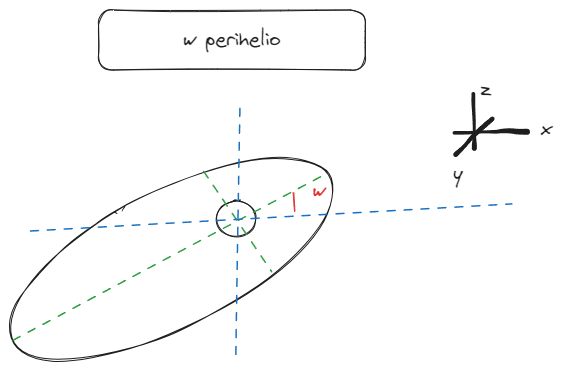

# Configuracion del Proyecto 
## Instalacion
con pnpm y node 
- Instalar react con vite   
```$ pnpm create vite ```
- Instalar tailwincss  
```$ pnpm install -D tailwindcss postcss autoprefixer ```
- Configurar Tailwind  
```$ pnpm dlx tailwindcss init -p ```  
    En el archivo **tailwind.config.js** modificar la propiedad:
    ``` 
    content: [
        "./index.html",
        "./src/**/*.{js,ts,jsx,tsx}",
    ]
    ```
    En el archivo ```./src/index.css``` se debe agregar lo siguiente:
    ```
        @tailwind base;
        @tailwind components;
        @tailwind utilities;
    ```
- Instalar three y three-fiber Opcional three-drei  
```pnpm install three @react-three/fiber ```  
```pnpm install @react-three/drei ```
## Core
Se ejecutara con la libreria **three.js** ademas de ejecutar la "libreria" para react **fiber**, para facilitar el manejo de marcos de trabajo.
### Preparacion de un componente-scena en **three.js**
Importar la libria 
``` 
import * as THREE from "three"; 
```
Variables para referenciar el Componente
```
//Variables globales
let currentRef = null;
```
Para tener un componente se necesita una scena, camara y render. Estos elementos seran nescesarios para el proceso de renderizacion.  
Crear la scene https://threejs.org/docs/#api/en/scenes/Scene
```
const scene = new THREE.Scene();
```
Crear camara configurarla y add en la scene. https://threejs.org/docs/#api/en/cameras/PerspectiveCamera
```
//perspectiveCamera(FOV,relacion de aspecto,near ,far)
const camera = new THREE.PerspectiveCamera(25, 100 / 100, 0.1, 100);
scene.add(camera);
camera.position.set(5, 5, 5);
camera.lookAt(new THREE.Vector3());
```
Crear Render de la scena  
```
const renderer = new THREE.WebGLRenderer();
renderer.setSize(100, 100); 
```
Funciones para montar y desmontar la escena, se debe renderizar en la referencia del componente.
```
Montar el render en un componente 
//iniciar y montar la escena
export const initScene = (mountRef) => {
  currentRef = mountRef.current;
  resize();
  currentRef.appendChild(renderer.domElement);
};

//Desmonrtar y limpiar el bufer de la scena
export const cleanUpScene = () => {
  scene.dispose();
  currentRef.removeChild(renderer.domElement);
};
```
### preparacion de un componente en **fiber**
Para una configuracion sencilla solo se debe utilizar los componentes **Canvas** y **UseFrame**.  
Canvas Se utiliza para Configurar el marco de desarrollo en el componente **"Canvas"** https://r3f.docs.pmnd.rs/api/canvas
```
import React from 'react'
import { Canvas } from '@react-three/fiber'

const App = () => (
  <Canvas camera={{ position: [0, 0, 10] }}>
    Colores <color attach="background" args={['black']} />
    Luces <pointLight position={[10, 10, 10]} />
    <mesh>
      geometria
      material
    </mesh>
  </Canvas>
)
```
UseFrame permite ejecutar codigo cada cuadro de renderizado. https://r3f.docs.pmnd.rs/api/hooks
```
import { useFrame } from '@react-three/fiber'

function Foo() {
  useFrame((state, delta, xrFrame) => {
    // se ejecuta en cada cuadro de refreasco
  })
```

# Teoria - Orbitas 
Conciderare heliocentricas, para luego generalizar.
### Leyes de Kepler
... aquivan las leyes de kepler XD ... 
https://www.amsat.org/keplerian-elements-tutorial/
### Elementos orbitales

- Excentricidad de la órbita (e) - forma de la elipse, que describe cuánto se alarga en comparación con un círculo.
- Semieje mayor de la órbita (a) - la suma de las distancias minima y maxima dividida por dos. Para las órbitas clásicas de dos cuerpos, el semieje mayor es la distancia entre los centros de los cuerpos, no la distancia de los cuerpos desde el centro de masa.


Definen la orientación del plano orbital en el que se incrusta la elipse:
- Inclinación de la órbita (i) - inclinación vertical de la elipse con respecto al plano de referencia, medida en el nodo ascendente.

- Longitud del nodo ascendente (o) orienta horizontalmente el nodo ascendente de la elipse con respecto al punto vernal del marco de referencia.

- Argumento del perihelio (w). define la orientación de la elipse en el plano orbital, como un ángulo medido desde el nodo ascendente hasta la periapsis.

- Anomalía media de la época (M)

## Datos para representar

Para concideracion de datos a representar se traera los siguientes datos para parametrisar y representar algunas orbitas.

Esto se consigue de la api de la nasa https://ssd.jpl.nasa.gov/tools/sbdb_lookup.html#/?sstr=43&view=VOPDA
### Datos de la nasa
Los datos de la nasa obtenidos varian segun la api de referencia, unos contienen mas datos y otros menos, se requiere clasisificar segun a la info y a la importancia para el proyecto.

ejemplo de DAtos Obtenidos: en formato JSon
```
[
    {
        "object": "P/2004 R1 (McNaught)",
        "epoch_tdb": "54629",
        "tp_tdb": "2455248.548",
        "e": "0.682526943",
        "i_deg": "4.894555854",
        "w_deg": "0.626837835",
        "node_deg": "295.9854497",
        "q_au_1": "0.986192006",
        "q_au_2": "5.23",
        "p_yr": "5.48",
        "moid_au": "0.027011",
        "ref": "20",
        "object_name": "P/2004 R1 (McNaught)"
    },
    {
        "object": "P/2008 S1 (Catalina-McNaught)",
        "epoch_tdb": "55101",
        "tp_tdb": "2454741.329",
        "e": "0.6663127807",
        "i_deg": "15.1007464",
        "w_deg": "203.6490232",
        "node_deg": "111.3920029",
        "q_au_1": "1.190641555",
        "q_au_2": "5.95",
        "p_yr": "6.74",
        "moid_au": "0.194101",
        "ref": "13",
        "object_name": "P/2008 S1 (Catalina-McNaught)"
    },
]
```
### Interpretacion de los datos
Se tiene un tutorial para poder codificar elipces a partir de datos https://nasa.github.io/mission-viz/RMarkdown/Elliptical_Orbit_Design.html

Esto servira para dibujar las trayectorias, ademas se tiene que tener en cuenta que se debe corregir la pacicion del cuerpo segun la anomaloa de la epoca.

## Propagacion Orbital

La propagacion orbital es para tener una pocicion segun el tiempo dado y la orbita.
Para ello se tiene que tener en cuenta los datos ya mencionados. 

segun a lo que pienso para animar un trayectoria se debe tener encuanta la siguiente estructura de datos.
```
class Trajectory(){

   name:string                          // nombre del objeto
   smA:float                            //semi eje 
   oI:float(se debe corregir)                 // inclinacion
   aP:float(se debe corregir)                 // perihelio
   oE:float                              // excentrecidad
   aN:float(se debe corregir)                 // nodo asencion
   period:Sidereal(se debe conciderar con los datos)   // periodo sideral
   epochMeanAnomaly:mAe(se debe corregir segun clase de objeto)  // anomalia de epoca 
   trueAnomoly:0                      // inicilacion sobre clase de aomalia
   position:[0,0,0] Vector3 //posicion actual del objeto 
   time:0 (realtivo) // tiempo de instancia o de muestra 
}
```

PARA EL CONSTRUCTOR SE DEBERIA TOMAR EN CUENTA SOLO LOS SIGUIENTES DATOS ``` Trajectory(name, smA,oI,aP,oE,aN,mAe,Sidereal)```

Para poder "propagar" la orbita se debe tener en cuenta  se deben tener encuenta los 
vectores de estado orbital (un vector tridimensional para la posición y otro para la velocidad) mediante transformaciones.

Para obtener las posiciones se deben tomar en cuena las transformaciones de los ángulos de Euler o quaterniones.  
Para los angulos de euler :  
forma 1:  
x,y,z como argumentos de generacion de un plano:  
xi=cos(aP)*cos(aN) - sin(aP)*(var)*sin(aN)  
aTan2(x,y) //  argumento polar  
forma 2:  
sLR = smA * (1 - oE^2) ;             // semilado.  
r = sLR/(1 + oE * Math.cos(var));  // distacia radial.  